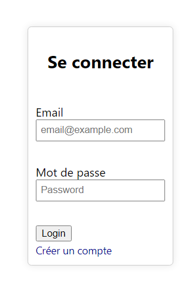
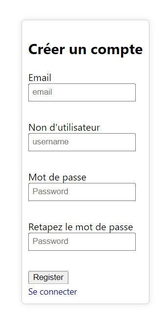
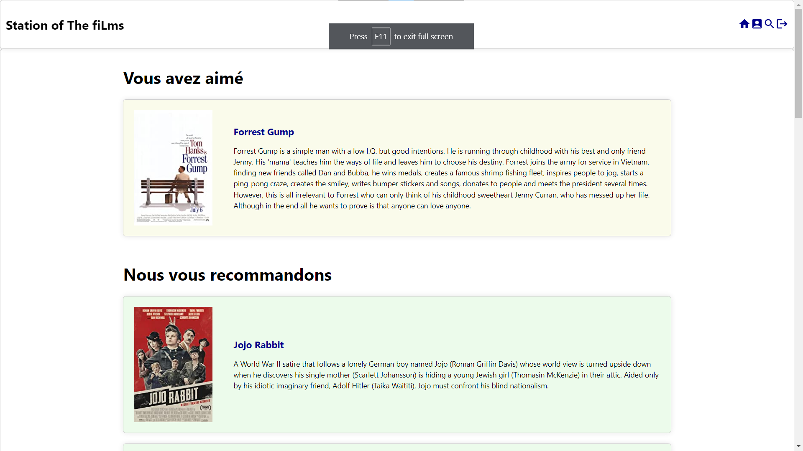
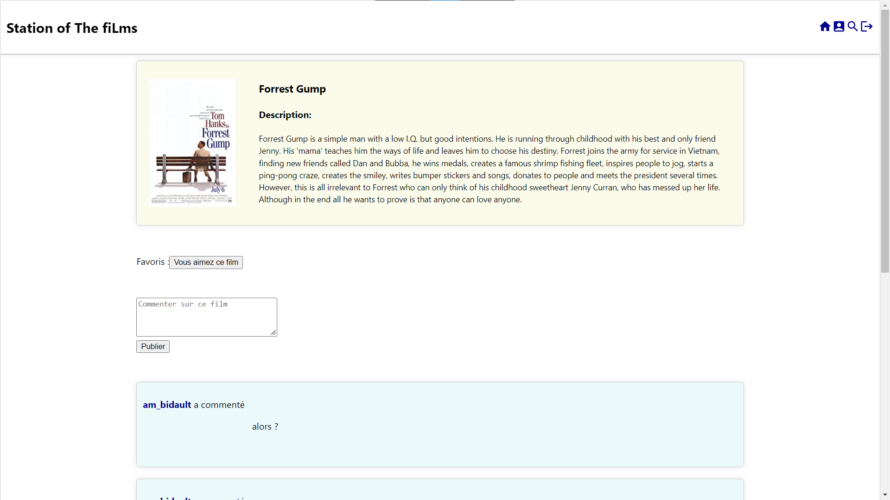
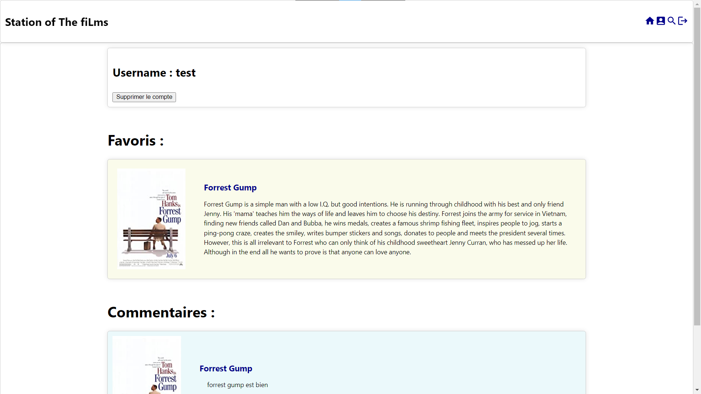
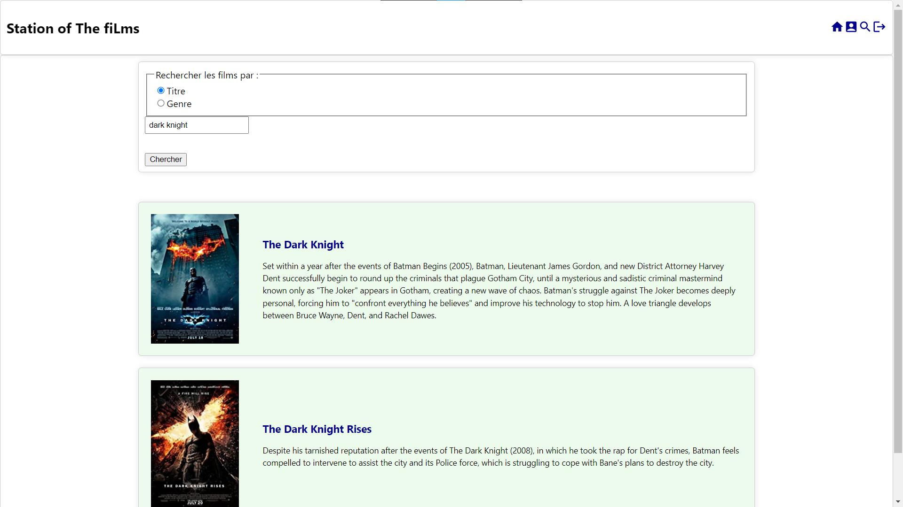
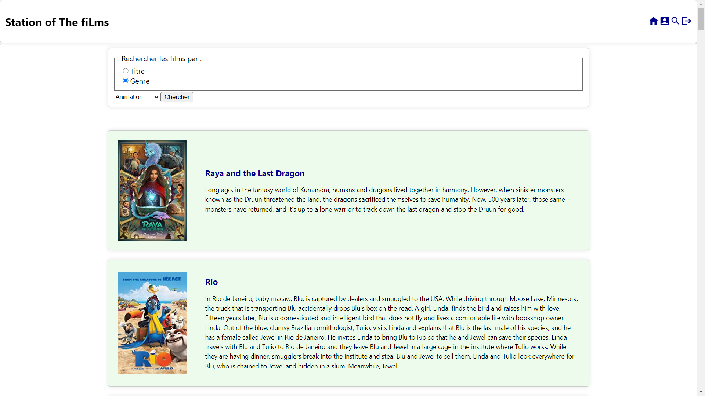

# Projet de PC3R
### Par Yukai Luo et Lucas Fumard

Repo Gitlab : https://stl.algo-prog.info/28602386/projet-pc3r

# Accès au site

Le site est hébergé de manière locale, il faut lancer le backend et le frontend avec les scripts simples `launch_backend.sh` et `launch_frontend.sh` respectivement. 

Nous avons autorisé toutes les adresses à se connecter à la base de données, mais s'il y a un problème de connection à MongoDB, nous recommandons de lancer le site depuis une adresse ip de la PPTI.

# Description
Le site est un site de recommendation de films. La page d'acceuil (une fois connecté) affiche un fil de recommendations en fonction des films mis en "favori" par l'utilisateur. Si il n'y a pas assez de "favoris", le site affiche une file de recommendation des films les plus favorisés sur le site. Un utilisateur peut afficher la page d'un film en cliquant sur sur une vignette ou en le cherchant. La page d'un film contient la description du film, tous les commentaires des utilisateurs sur le film, un bouton pour ajouter/retirer des favoris, et une liste de films similaires. On peut gérer sa liste de favoris et ajouter/retirer un commentaire à un film

# Choix des Technologies
Nous utilisons Go pour le backend et React avec axios pour le frontend.
    
- **Go**: Go est connu pour sa rapidité d'exécution. Il est plus rapide que Java pour certaines tâches, ce qui est particulièrement important pour les serveurs Web. En plus, Go est un langage de programmation minimaliste, ce qui signifie qu'il nécessite moins de code pour réaliser les mêmes fonctionnalités que Java. Cela facilite la maintenance et la mise à jour du code, et nous rend plus facile à apprendre et à utiliser. D'ailleurs, Go a été conçu pour gérer la concurrence et les problèmes de synchronisation plus facilement que Java. Cela le rend idéal pour les serveurs Web, où de nombreuses requêtes sont gérées simultanément. 
   
- **React.js**: React.js est une bibliothèque JavaScript *open-source* pour la création d'interfaces utilisateur,utilisée pour la création d'applications web modernes et interactives.    
Parmi les avantages de cette technologie, il y a l'utilisation du Virtual DOM (Document Object Model) qui permet une mise à jour plus efficace et rapide des éléments d'une page. Le Virtual DOM est une représentation virtuelle d'un arbre DOM qui est stockée en mémoire et mise à jour en temps réel en fonction des interactions de l'utilisateur avec l'interface. On modifie seulement les éléments impactés, et non l'ensemble du DOM de la page, ce qui se traduit par des temps de réponse plus rapides et des meilleures performances.    
Aussi, React est basé sur la programmation orientée composant. L'interface utilisateur est décomposée en petits composants réutilisables, chacun étant responsable de l'affichage d'une partie spécifique de l'interface. Chaque composant est construit de manière indépendante et peut être utilisé à plusieurs endroits dans une application. Cette approche modulaire rend l'interface plus flexible et maintenable.

# API
https://rapidapi.com/SAdrian/api/moviesminidatabase pour la liste des films, la description des films, les recommendations, et la recherche des films
https://cloud.mongodb.com/ pour la base de données

# Usecase

Alice se connecte au site. Elle veut une recommendation de film. Le site affice une file de recommendations selon les films quelle a mit en "favoris". Si elle n'a pas de films favoris, le site montre une file de recommendations des films les plus favoris du site.

Bob veut commenter sur un film. Il clique sur "Films" et cherche sont film. Il va sur la page du film et entre son commentaire dans la boite prévue à cet effet. Il appuie sur "Confirmer" et son commentaire est enregisstré sur la page du film.

Carol veut "aimer" un film. Elle cherche son film en cliquant sur "films". Elle va sur la page du film et clique sur le bouton "Ajouter aux favoris".

# Structure de donnés

- # **Base de données**

  
  Nous avons stoké deux type dans la base de donné. Le type "User" contient son id, son nom, son mot de pass, son addresse email, et un list de ids des films qu'il a aimé. Le type commentaire contient son id, son id d'utilisateur, son id de film, et son contenu.

- # **Hors DB**

   
Ce trois types "Film", "Result_film" et "Result_films" sont pour obtenir les films par l'API. Le type "Film" contient son id, son titre, sa description et son image. Dans "Result_film" et "Result_films" nous avons ajouté un boolean "Success" qui signifie si ce(s) film(s) est bien trouvé.   

  
    
Nous avons créé un type "User_out" pour stoker un utilisateur obtenu par la base de donné. Cela évite de porter les paramètres inutile dans le server(par example le email et le mot de passe d'un utilisateur) et rend le code dans le server plus propre. Le type "Result_user" est la resultat de la base de donné, et le "Result_user_out" est le resultat de transformation depuis un "User".
   
    
   
Pour gérer les commentaires, nous avons créé deux types, le "Commentaire_film" qui s'affiche dans le page film, le "Commentaire_user" qui s'affiche dans le profile d'utilisateur.    
   
 
   
Nous avons créé un type "Film_Fav" qui prend l'id de utilisateur et un film et un boolean signifie si cet utilisateur a aimé ce film.
 

# Services
- Authentification
- Recommendation de films
- Recherche de film (par titre/genre)
- Commentaires sur un film

# Appel à l'API
Lors de la recherche de film (on cherche en parallèle notre base de données et l'api et on stocke les films qu'on a pas stocké)
Lors de la recherche de recommendations (on cherche en parallèle notre base de données et l'api et on stocke les recommendations qu'on a pas stocké)

# Client
- Page login

- Page search

- Page film

- Page recommendations

- Page profil utilisateur

Page film : titre, descripion, image, commentaires et bouton favori

# Requetes

Types définis dans le fichier [types.go](/serveur/types/types.go)

### Authentification
- [X] POST /login {password:string, email:string} -> {userid: string, session:string}
### Déconnection
- [X] POST /logout {auth:{userid:string, session:string}} -> {}
### Créer utilisateur
- [X] PUT /user {username:string, password:string, email:string} -> User
### Supprimer utilisateur
- [X] DELETE /user/userid {auth:{userid:string, session:string}} -> User
### Prendre utilisateur
- [X] GET /user/userid -> User
### Ajouter un commentaire
- [X] PUT /comment {user_id:string, contenu:string, film_id:string, auth:{userid:string, session:string}} -> Commentaire_film
### Commentaires d'un utilisateur
- [X] GET /comment/user/userid -> \[Commentaire_user\]
### Commentaires d'un film
- [X] GET /comment/film/movieid -> \[Commentaire_film\]
### Supprimer un commentaire
- [X] DELETE /comment/id {auth:{userid:string, session:string}} -> Commentaire
### Recherche de film par titre
- [X] GET /search/title/movie%20title -> \[Film\]
### Recherche de film par genre
- [X] GET /search/genre/Genre -> \[Film\]
### Recherche de film par ID
- [X] GET /film/movieid -> Film
### Recommendations d'un utilisateur
- [X] GET /recommend/user/userid -> \[Film\]
### Recommendations d'un film
- [X] GET /recommend/film/movieid -> \[Film\]
### Favoris d'un utilisateur 
- [X] GET /favorites/user/userid -> \[Film\]
### Changement favoris utilisateur
- [X] POST /favorite {film_id:string, user_id:string, favorite:boolean, auth:{userid:string, session:string}} -> Film_fav
### Film est favoris d'un utilisateur
- [X] GET /favorite/film/filmid/userid -> Film_fav

# Présentation site

Lorsque le site est ouvert, le client est accueilli par la page de connection.

Le client peut se connecter ou cliquer sur "Créer un compte".

Une fois connecté, le client se retrouve sur la page d'accueil.

Le client peut accéder cette page en cliquant sur l'icone de maison en haut à droite.
Sur cette page, se trouvent les films que le client a favorisé et les recommendations par rapport aux genres de ces films.

En cliquant sur un film, le client arrive sur la page du film.

Sur cette page, le client peut lire une description, ajouter/retirer le film des favoris, ajouter des commentaires, supprimer ceux qu'il a posté et lire les autres commentaires.

Cliquer sur le nom d'un utilisateur ammène sur la page profil de l'utilisateur.

La page profil du client peut être accédée en cliquant sur la deuxième icone en haut à droite, en partant de la gauche (l'icone profil).

Sur cette page, le client peut supprimer son compte, accéder aux films favoris et accéder et supprimer ses commentaires

En cliquant sur l'icone de loupe en haut à droite, le client arrive sur la page de recherche.

Le client peut ainsi chercher des films par titre ...

Ou par genre.

Il est à noter que la recherche par genre prend plus de temps que la recherche par titre.

Enfin, en cliquant sur l'icone de déconnection, l'utilisateur est déconnecté et revient à la page de connection.# Station_of_The_fiLm

